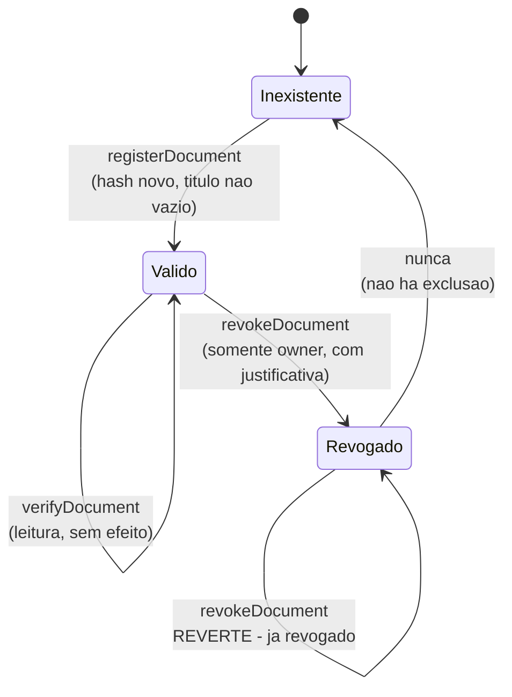

# 04 — Smart Contract

> Seção 4 do relatório técnico do **Veridia — Cartório Distribuído**.
> Analisa o contrato `contracts/CartorioNotarial.sol`: estado, funções, regras de negócio,
> ciclo de vida do documento e decisões de projeto.

---

## 4.1 Visão geral

| Atributo | Valor |
|----------|-------|
| Arquivo | `contracts/CartorioNotarial.sol` |
| Linhas | 166 |
| Versão do compilador | `pragma solidity ^0.8.24` (pinada em `hardhat.config.js`) |
| Licença | MIT |
| Contrato | `CartorioNotarial` — único contrato do projeto |
| Dependências externas | Nenhuma (sem OpenZeppelin, sem imports) |
| Construtor | Nenhum — não há inicialização nem papel de administrador |
| Modificadores | Nenhum — a validação é feita por `require` explícito |
| Bibliotecas | Nenhuma |

O contrato é autocontido. Essa escolha, alinhada a AD1 em
[03 — Arquitetura do Sistema](03-arquitetura-do-sistema.md), tem duas consequências: o
código é inteiramente auditável em 166 linhas, e as regras dependem apenas do comportamento
próprio da linguagem, sem a inclusão de bibliotecas externas.

---

## 4.2 Estado (storage)

```mermaid
erDiagram
    DocumentRecord {
        bytes32 documentHash "chave primaria"
        string title
        string documentType
        string description
        address owner
        uint256 registeredAt "sentinela de existencia"
        bool isValid
        string revocationReason
        uint256 revokedAt
    }
    documents {
        bytes32 "hash -> DocumentRecord"
    }
    allDocumentHashes {
        bytes32 "indice apenas-adicao"
    }
```

| Declaração | Tipo | Visibilidade | Papel |
|-------------|------|--------------|-------|
| `documents` (`:25`) | `mapping(bytes32 => DocumentRecord)` | `private` | Armazenamento principal. Chave: o hash. Acesso O(1). |
| `allDocumentHashes` (`:28`) | `bytes32[]` | `private` | Índice de enumeração, apenas-adição, para listagem no explorador. |

Nenhuma variável de estado é `public`, portanto **não existem getters automáticos** na ABI.
Toda leitura passa obrigatoriamente por uma das funções `view` explícitas — uma escolha que
mantém a superfície de leitura do contrato fechada e previsível.

### 4.2.1 O sentinela `registeredAt`

O contrato não possui um campo `bool exists`. A existência de um registro é derivada:

```solidity
// CartorioNotarial.sol:149-151
function isRegistered(bytes32 _documentHash) external view returns (bool) {
    return documents[_documentHash].registeredAt != 0;
}
```

A mesma condição aparece na validação de duplicidade (`:62`) e no início de `verifyDocument`
(`:108`). Como `registeredAt` recebe `block.timestamp` no momento do registro (`:70`), e
timestamps reais nunca são zero, o teste é equivalente a um `exists` explícito — com a
vantagem de não consumir um slot de storage por registro.

### 4.2.2 A lista enumerável

Um `mapping` em Solidity **não é iterável**: não há como listar suas chaves. Para que a aba
**Explorador** e o endpoint `GET /api/documents` possam apresentar todos os documentos
registrados, o contrato mantém o array `allDocumentHashes`, alimentado com um `push` a cada
registro (`:76`). É a solução padrão para essa limitagem da linguagem.

---

## 4.3 Funções

### 4.3.1 Funções de escrita

#### `registerDocument`

```solidity
function registerDocument(
    bytes32 _documentHash,
    string calldata _title,
    string calldata _documentType,
    string calldata _description
) external
```

Declarada em `:54-85`. É a única forma de criar um registro. Sequência de execução:

1. **Validações** (`:60-62`), todas com `require`:
   - `_documentHash != bytes32(0)` → `"Hash do documento nao pode ser vazio"`
   - `bytes(_title).length > 0` → `"Titulo do documento e obrigatorio"`
   - `documents[_documentHash].registeredAt == 0` → `"Documento ja registrado anteriormente"`
2. **Escrita do registro** (`:64-74`), com valores derivados:
   - `owner: msg.sender` — a titularidade vem da assinatura, nunca de um parâmetro
   - `registeredAt: block.timestamp` — o tempo vem do protocolo, nunca de um parâmetro
   - `isValid: true`, `revocationReason: ""`, `revokedAt: 0`
3. **Indexação** (`:76`): `allDocumentHashes.push(_documentHash)`
4. **Evento** (`:78-84`): `DocumentRegistered(_documentHash, _title, _documentType, msg.sender, block.timestamp)`

**Observação de projeto:** a interface `calldata` é usada em todos os parâmetros de string.
Ela evita a cópia dos dados para a memória, reduzindo o custo de gas de leituras de argumentos.

**Observação de segurança:** `owner` e `registeredAt` não podem ser falsificados, pois não
são parâmetros. Isso elimina de raiz a classe de ataque mais comum em contratos de registro —
o registro em nome de terceiros.

#### `revokeDocument`

```solidity
function revokeDocument(bytes32 _documentHash, string calldata _reason) external
```

Declarada em `:131-144`. Quatro validações (`:134-137`):

| Ordem | Condição | Mensagem de reversão |
|-------|----------|----------------------|
| 1 | `doc.registeredAt != 0` | `Documento inexistente na base de dados` |
| 2 | `doc.owner == msg.sender` | `Nao autorizado: apenas o titular pode revogar` |
| 3 | `doc.isValid` | `Documento ja se encontra revogado` |
| 4 | `bytes(_reason).length > 0` | `Justificativa da revogacao e obrigatoria` |

A ordem das validações é relevante: Existence vem **antes** do controle de acesso, para que
um endereço não titular receba a mesma resposta para documentos inexistentes e existentes.
Em seguida, `isValid = false`, `revocationReason = _reason` e `revokedAt = block.timestamp`
(`:139-141`), e o evento `DocumentRevoked` (`:143`).

**A revogação nunca apaga dados.** Ela acrescenta informação ao registro, mantendo-o
integralmente disponível para auditoria. Não existe `delete` no contrato — é a manifestação
mais direta da propriedade de imutabilidade descrita em
[1.3](01-definicao-e-escopo.md#13-justificativa-do-uso-de-blockchain).

### 4.3.2 Funções de leitura

Todas são `view`: não alteram estado, não geram transação e **não custam gas**.

| Função | Assinatura | Declaração | Comportamento |
|--------|-----------|------------|---------------|
| `verifyDocument` | `verifyDocument(bytes32) → (bool exists, bool isValid, string title, string documentType, string description, address owner, uint256 registeredAt, string revocationReason, uint256 revokedAt)` | `:92-123` | Retorna a tupla de 9 campos. Para documento inexistente, retorna `(false, false, "", "", "", address(0), 0, "", 0)` (`:109`). |
| `isRegistered` | `isRegistered(bytes32) → bool` | `:149-151` | `true` se `registeredAt != 0`. |
| `getDocumentCount` | `getDocumentCount() → uint256` | `:156-158` | `allDocumentHashes.length`. |
| `getAllDocumentHashes` | `getAllDocumentHashes() → bytes32[]` | `:163-165` | Copia integral do array de índices. Alimenta o explorador. |

**Decisão relevante em `verifyDocument`:** a função **não** faz `revert` quando o documento
não existe. Retorna uma tupla com `exists = false`. A alternativa (`require` com reversão)
seria mais "pura" em termos de API, mas tornaria impossível, no EVM, distinguir "não existe"
de "erro de execução" sem um *try/catch*. Como a verificação pública é um caso de uso central
— Inclusive para quem está apenas sondando se existe um registro — a função ser não-revertente
é a escolha correta. O frontend trata os dois casos explicitamente: `exists == false` gera o
estado "Documento Não Encontrado", e um hash inválido no formato é normalizado com o prefixo
`0x` antes da chamada.

### 4.3.3 Superfície pública da ABI

A ABI compilada contém exatamente **6 funções e 2 eventos**, sem acréscimos:

| Tipo | Nome |
|------|------|
| Funções | `getAllDocumentHashes`, `getDocumentCount`, `isRegistered`, `registerDocument`, `revokeDocument`, `verifyDocument` |
| Eventos | `DocumentRegistered`, `DocumentRevoked` |

Não existem receive/fallback, não há `selfdestruct`, não há delegatecall, e não há funções
administrativas. A superfície é mínima, o que reduz a superfície de ataque.

---

## 4.4 Ciclo de vida do documento



O registro tem **apenas dois estados estáveis** e **nenhuma saída do sistema**: uma vez
registrado, o documento permanece para sempre, em um dos dois estados. Isso decorre
diretamente das regras de negócio: a imutabilidade é o produto, não um efeito colateral.

| Transição disparada por | Condição de sucesso | Reversões possíveis |
|--------------------------|--------------------|--------------------|
| `registerDocument` | hash não vazio, título não vazio, hash ainda não registrado | hash vazio; título vazio; hash já registrado |
| `revokeDocument` | registro existe, `msg.sender == owner`, `isValid == true`, motivo não vazio | inexistente; não autorizado; já revogado; motivo vazio |

---

## 4.5 Eventos

```solidity
event DocumentRegistered(
    bytes32 indexed documentHash,
    string  title,
    string  documentType,
    address indexed owner,
    uint256 registeredAt
);

event DocumentRevoked(
    bytes32 indexed documentHash,
    address indexed revoker,
    string  reason,
    uint256 revokedAt
);
```

| Aspecto | `DocumentRegistered` | `DocumentRevoked` |
|---------|----------------------|-------------------|
| `indexed` | `documentHash`, `owner` | `documentHash`, `revoker` |
| Campos em `logs` | `title`, `documentType`, `registeredAt` | `reason`, `revokedAt` |
| Emissão | Fim de `registerDocument` (`:78`) | Fim de `revokeDocument` (`:143`) |

O campo `indexed` em hash e endereço é uma decisão de infraestrutura: permite que ferramentas
de auditoria filtrem a trilha de eventos por documento ou por titular sem processar todos os
logs. Strings não podem ser indexadas no EVM, o que justifica `title` e `reason` ficarem
apenas nos logs da transação — acessíveis, porém não filtráveis.

A especificação previa também um evento `OwnershipTransferred`, que **não foi implementado**,
por não existir função de transferência de titularidade. Ver
[09](09-limitacoes-e-divergencias.md).

---

## 4.6 Decisões de projeto e trade-offs

| Decisão | Alternativa descartada | Justificativa |
|---------|------------------------|---------------|
| Hash como chave primária | `uint256 id` autoincrementado | O hash *é* a identidade. Um ID artificial não impediria o registro duplicado do mesmo conteúdo, que é a garantia central do sistema. |
| Revogação em vez de exclusão | `delete documents[hash]` + remoção do array | Preserva a trilha de auditoria e é a aplicação correta da imutabilidade. O custo é que o estado nunca diminui. |
| Sentinela `registeredAt != 0` | Campo `bool exists` | Economiza um slot de storage por registro e simplifica as três verificações de existência. |
| `require` com mensagens em português | `require` sem mensagem / `custom error` | A mensagem aparece na interface do usuário. O frontend mapeia os textos conhecidos para explicações mais
longas — por exemplo, `"Documento ja registrado"` vira um aviso de duplicidade, e
`"Nao autorizado"` vira "Apenas a carteira titular pode revogar". |
| Sem herança de `AccessControl` | OpenZeppelin `Ownable` / `AccessControl` | O único papel é o próprio titular, e a checagem cabe em uma linha. Um contrato sem dependências externas é mais fácil de auditar neste contexto acadêmico. |
| Strings como `calldata` | `string memory` | Evita cópia para a memória e reduz o custo de gas das operações de escrita. |
| `verifyDocument` não reverte | `revert` em documento inexistente | Permite distinguir "inexistente" de "erro" no EVM, sem *try/catch*, atendendo ao caso de uso de sondagem. |
| Sem `transferOwnership` | Função de transferência prevista na spec | Ver [09](09-limitacoes-e-divergencias.md). |
| Retorno multi-valor em vez de `getDocument` | Função que retorna a `struct` | Retornar uma `struct` exigiria que a interface a reconstruísse, expondo todos os campos por padrão. A tupla explícita documenta a ordem e permite omitir campos internos. |
| Sem proteção contra reentrância | `ReentrancyGuard` | Nenhuma operação faz chamada externa; não há superfície para reentrância. O guard seria código morto. |
| `isValid` empacotado com `revokedAt` | Slots separados | O compilador empacota automaticamente tipos pequenos; não é necessário intervir. |

---

## 4.7 Limites do contrato

É importante registrar o que o contrato **não** faz, para evitar leitura equivocada:

- **Não valida o hash.** `registerDocument` aceita qualquer `bytes32` não nulo. O contrato não
  tem como saber se o digest corresponde a um arquivo existente, nem se foi calculado
  corretamente. A integridade é verificada no cliente, comparando o hash local com o armazenado.
- **Não valida o conteúdo dos metadados.** `title`, `documentType` e `description` são aceitos
  como texto livre. Nada impede inserir dado pessoal nesses campos.
- **Não autentica identidade.** `owner` é um endereço. Não há vínculo com pessoa física ou
  jurídica, e não há verificação de idade, identidade ou capacidade.
- **Não tem administrador.** Não existe função de emergência, de migração ou de correção. Uma
  vez implantado, o contrato é imutável e definitivo.
- **Não impede registros em duplicidade de metadados.** Dois documentos diferentes podem ter
  o mesmo título e a mesma categoria; a unicidade é sobre o hash, não sobre o conteúdo textual.
- **Não é upgradeável.** Alterar as regras exige implantar um novo contrato em um novo
  endereço e reconstruir a base.

---

## Navegação

← [03 — Arquitetura do Sistema](03-arquitetura-do-sistema.md) · Índice: [README](README.md) ·
Próxima: **[05 — Backend](05-backend.md)**
