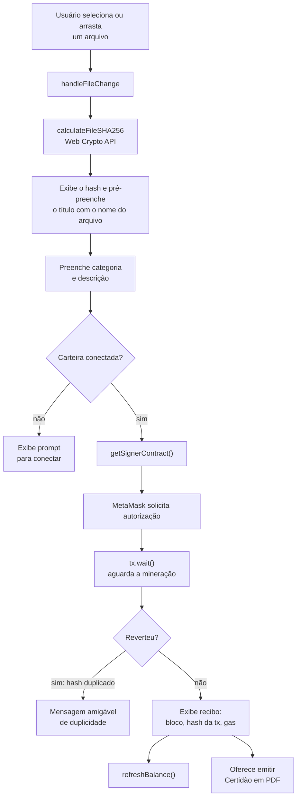

# 06 — Frontend

> Seção 6 do relatório técnico do **Veridia — Cartório Distribuído**.
> Descreve a SPA em React: estrutura, painéis, integração com a carteira, utilitários
> criptográficos e o sistema de design efetivamente implementado.

---

## 6.1 Visão geral

| Atributo | Valor |
|----------|-------|
| Framework | React 18.3 (JSX, sem TypeScript) |
| Bundler | Vite 5 |
| Estilização | Tailwind CSS 3.4 + PostCSS/autoprefixer |
| Ícones | lucide-react 0.395 |
| Web3 | Ethers 6.13 |
| Porta (dev) | `5173` |
| Proxy | `/api` → `http://localhost:3001` |
| Dependências extras | `clsx`, `tailwind-merge` |
| Roteamento | **Nenhum** — a navegação é um `useState` em `App.jsx` |

O sistema de rotas é o principal desvio do padrão comum em SPAs: em vez de `react-router`, o
`App.jsx` mantém um estado `activeTab` com três valores possíveis (`register`, `verify`,
`explorer`) e renderiza o painel correspondente. Para uma aplicação de três visões sobre um
mesmo contexto, isso evita uma dependência adicional sem prejuízo de usabilidade — decisão
registrada como AD8 em [03](03-arquitetura-do-sistema.md#36-decisões-arquiteturais).

---

## 6.2 Estrutura

```text
frontend/
├── index.html                  # Shell pt-BR, fontes Google
├── vite.config.js              # Porta 5173 e proxy /api
├── tailwind.config.js          # Tokens do design system
├── postcss.config.js
├── dist/                       # Build de produção versionado
└── src/
    ├── main.jsx                # createRoot + StrictMode
    ├── App.jsx                 # Shell de abas e rodapé
    ├── index.css               # Diretivas Tailwind e classes de componente
    ├── components/
    │   ├── Navbar.jsx                  # Abas, indicador de rede, painel da carteira
    │   ├── RegisterDocument.jsx        # Painel 1 - registro
    │   ├── VerifyDocument.jsx          # Painel 2 - consulta, revogação e certidão
    │   ├── BlockchainExplorer.jsx      # Painel 3 - métricas, registros e blocos
    │   └── CertificateModal.jsx        # Modal de pré-visualização da certidão
    ├── context/
    │   └── WalletContext.jsx    # Estado global da carteira (Ethers + MetaMask)
    ├── utils/
    │   └── cryptoUtils.js      # SHA-256 no navegador e formatadores
    └── config/
        └── contractConfig.json # Gerado pelo deploy.js (endereço + ABI)
```

---

## 6.3 `WalletContext` — o núcleo de integração

O `WalletContext` centraliza todo o estado Web3 da aplicação e o expõe por meio do hook
`useWallet()`. Concentrar isso evita que cada painel precise lidar diretamente com a
`window.ethereum`.

### 6.3.1 Estado exposto

| Estado | Tipo | Origem |
|--------|------|--------|
| `account` | `string \| null` | `eth_requestAccounts` |
| `chainId` | `number \| null` | `eth_chainId` |
| `balance` | `string \| null` | `provider.getBalance`, formatado em ETH |
| `isConnected` | `boolean` | Derivado de `account` |
| `isConnecting` | `boolean` | Durante a autorização |
| `error` | `string \| null` | Mensagens de falha |
| `contractAddress` | `string \| null` | Endpoint de status do backend, com *fallback* para o `contractConfig.json` local |

### 6.3.2 Funções

| Função | Comportamento |
|--------|---------------|
| `connectWallet()` | Instancia `ethers.BrowserProvider(window.ethereum)` e chama `eth_requestAccounts`. Exibe mensagem amigável se a MetaMask não estiver instalada. |
| `disconnectWallet()` | Limpa o estado local. Como a MetaMask não tem logout real, a desconexão é apenas da interface. |
| `refreshBalance(acc)` | Lê e formata o saldo da conta. |
| `switchToGanacheNetwork()` | Solicita `wallet_switchEthereumChain` para `0x539` (1337). Em caso de erro `4902` — código que significa "rede não adicionada" —, cai para `wallet_addEthereumChain`, criando a rede *Ganache Local* com RPC `http://127.0.0.1:7545` e moeda ETH. |
| `getSignerContract()` | Retorna um `ethers.Contract` ligado ao **signer da MetaMask**. É o caminho para as transações de escrita. |
| `getReadOnlyContract()` | Retorna um contrato de leitura. Usa o provider da MetaMask se ela estiver presente; caso contrário, cria um `JsonRpcProvider` puro apontando para `http://127.0.0.1:7545`. |

A distinção entre `getSignerContract` e `getReadOnlyContract` é a materialização, no
frontend, da separação de responsabilidades descrita em AD2 e AD3
([03](03-arquitetura-do-sistema.md#331-os-três-canais-de-comunicação)). Uma consulta
`view` feita por um usuário sem MetaMask funciona normalmente: o provider HTTP substitui a
carteira.

### 6.3.3 Reação a mudanças na carteira

Dois listeners do `provider` mantêm o estado sincronizado (`WalletContext.jsx`):

| Evento | Tratamento |
|--------|-----------|
| `accountsChanged` | Atualiza a conta; se a lista vier vazia, desconecta. |
| `chainChanged` | **Recarrega a página inteira.** |

O recarregamento em `chainChanged` é uma escolha simplificadora e deliberada: trocar de rede
altera o contrato com que se está falando, e recarregar reconstrói todo o estado sem precisar
sincronizar manualmente cada derivado. O custo é perder o estado local dos painéis.

O indicador de rede no `Navbar` considera válidas as chains `1337` e `5777` (as convenções do
Ganache GUI e CLI) e exibe um botão para mudar para a rede local quando a carteira está em
outra.

---

## 6.4 Painel 1 — `RegisterDocument`

Fluxo do usuário, do arquivo ao registro confirmado.



### 6.4.1 Cálculo do hash no navegador

```javascript
// frontend/src/utils/cryptoUtils.js:10-16
export async function calculateFileSHA256(file) {
  const arrayBuffer = await file.arrayBuffer();
  const hashBuffer = await crypto.subtle.digest("SHA-256", arrayBuffer);
  const hashArray = Array.from(new Uint8Array(hashBuffer));
  const hexString = hashArray.map((b) => b.toString(16).padStart(2, "0")).join("");
  return "0x" + hexString;
}
```

O arquivo é lido com `arrayBuffer()` e digerido por `crypto.subtle`, a **Web Crypto API**
nativa do navegador. Três consequências:

1. o conteúdo **nunca** é enviado para nenhum servidor — nem para o backend, nem para a
   blockchain;
2. o cálculo ocorre localmente, sem latência de rede;
3. a Web Crypto é uma API padrão e já segura de contexto, dispensando dependências como
   `crypto-js`.

O hash é exibido com botão de cópia para a área de transferência, e o tamanho do arquivo é
mostrado apenas como informação local (`RegisterDocument.jsx:190`). A interface explicita ao
usuário que *"o arquivo permanece estritamente local"* — a mesma promessa declarada em
[2.2](02-arquitetura-de-dados.md#22-fluxo-do-dado).

### 6.4.2 Metadados e envio

O formulário coleta **título** (obrigatório), **categoria** e **descrição** (opcional). A
categoria é um `select` com oito classificações notariais: Contrato, Certidão, Escritura,
Diploma, Procuração, Registro de Log, Rastreabilidade e Outro.

Após a assinatura e a mineração (`await tx.wait()`), a interface armazena o recibo —
`txHash`, `blockNumber` e `gasUsed` — e atualiza o saldo da carteira.

### 6.4.3 Tratamento de erros de negócio

O contrato comunica falhas por `require` com mensagens textuais. O painel traduz as duas mais
relevantes para a interface:

| Mensagem do contrato | Exibição na interface |
|----------------------|-----------------------|
| `Documento ja registrado anteriormente` | Aviso de que o conteúdo já consta na base, com orientação para verificar o registro existente |
| `Nao autorizado: apenas o titular pode revogar` | Aviso de que apenas a carteira titular pode revogar |

Quando a transação é revertida, o erro é extraído em cascata a partir de `err.reason`,
`err.message` e `err.data.message`, o que cobre as diferentes formas que o Ganache e a
MetaMask reportam uma reversão.

### 6.4.4 Painéis laterais

O painel inclui dois cartões de apoio: **Garantia de Privacidade** (explicando a separação
on-chain/off-chain, em `RegisterDocument.jsx:307`) e **Regra de Unicidade Notarial**
(explicando que o mesmo conteúdo não pode ser registrado duas vezes). Ambos traduzem as
regras do contrato para a linguagem do usuário leigo — uma escolha de interface que contribui
para o objetivo de transparência.

---

## 6.5 Painel 2 — `VerifyDocument`

Painel de auditoria, estruturado em torno de uma pergunta: *este documento é autêntico?*

### 6.5.1 Duas formas de entrada

| Entrada | Comportamento |
|---------|---------------|
| **Upload de arquivo** | Calcula o hash e dispara a verificação automaticamente. |
| **Hash colado** | Normaliza o valor, acrescentando o prefixo `0x` quando ausente, e verifica. |

A primeira opção é a mais relevante para o usuário comum: ele não precisa entender o que é um
hash. O arquivo selecionado é digerido e comparado, e o resultado vem em seguida.

### 6.5.2 Consulta e apresentação

A verificação usa `getReadOnlyContract()` e chama `verifyDocument` (`VerifyDocument.jsx:61-62`),
formatando as datas com `formatTimestamp`. O resultado é apresentado em um cartão que simula uma
janela de sistema operativo, contendo:

- selo de situação — **"Documento Válido & Vigente"** ou **"Documento Revogado"**;
- título e classificação;
- data de registro, status jurídico on-chain, endereço do titular e hash SHA-256 completo;
- descrição, quando informada;
- caixa destacada com o **motivo** e a **data da revogação**, quando aplicável;
- botão para baixar a certidão em PDF;
- estado próprio para **"Documento Não Encontrado"**, distinto dos demais.

### 6.5.3 Revogação

O botão de revogação só é exibido quando o documento é válido **e** a conta conectada é a
titular. A comparação é feita no cliente:

```javascript
const isOwner = connected && searchResult.owner.toLowerCase() === account.toLowerCase();
```

O uso de `toLowerCase()` nos dois lados é necessário, pois endereços Ethereum são
case-insensitive e o EVM devolve grafias variadas (checksum EIP-55). Após a revogação
assinada, o painel **reexecuta a verificação**, de modo que o estado exibido reflete
imediatamente o novo estado on-chain.

Esse botão é apenas uma **conveniência de interface**. A regra real está no contrato: um
terceiro que contorne a interface e chame `revokeDocument` diretamente é revertido por
`require(doc.owner == msg.sender)` (`CartorioNotarial.sol:135`). É um bom exemplo de por que
regras de negócio pertencem ao contrato e não à interface.

---

## 6.6 Painel 3 — `BlockchainExplorer`

Painel de auditoria pública, alimentado inteiramente pelo backend.

### 6.6.1 Coleta de dados

A cada ciclo, `fetchData()` dispara três requisições em paralelo
(`BlockchainExplorer.jsx:16`, `:23`, `:30`):

| Endpoint | Dados |
|----------|-------|
| `GET /api/documents/blockchain/status` | Estado do nó, altura do bloco, chain ID, preço do gas, endereço do contrato |
| `GET /api/documents/blockchain/blocks?limit=8` | Últimos 8 blocos |
| `GET /api/documents` | Todos os documentos registrados |

Os resultados são apresentados em quatro cartões de métrica (Rede, Altura do Bloco, Documentos
Ativos e Smart Contract) e em duas sub-abas:

- **Livro de Registros Notariais** — tabela com documento, categoria, hash truncado, data de
  registro, titular truncado e selo de situação;
- **Blocos Recentes** — cartões com número, data, contagem de transações, hash do bloco, gas
  utilizado e *miner*.

Há ainda um botão de atualização manual, útil durante demonstrações.

### 6.6.2 Atualização automática

```javascript
// frontend/src/components/BlockchainExplorer.jsx:44
const interval = setInterval(fetchData, 6000);
```

A atualização a cada **6 segundos**, com *cleanup* do intervalo no *unmount* do componente, é a
implementação de "explorador em tempo real" adotada.

Registra-se aqui uma divergência relevante: a especificação previa **escuta ativa de eventos**
do contrato (`queryFilter` ou listeners do Ethers) no backend. O que existe hoje é *polling*
periódico sobre a REST API. A diferença é real e tem consequências — o polling não reage a
eventos, ele lê o estado; e há uma janela de até 6 segundos entre um registro e sua exibição no
explorador. A análise completa está em
[09](09-limitacoes-e-divergencias.md).

### 6.6.3 `CertificateModal`

Modal sobreposto que apresenta uma pré-visualização da certidão antes do download, com um selo
de situação e uma tabela de três colunas (Título, Classificação, Hash SHA-256, Titular, Data
do Assento e Justificativa, quando revogado). O download aponta para
`/api/documents/<hash>/certificate`, aberto em nova aba com `rel="noopener noreferrer"`. O PDF
não é baixado pelo frontend — é gerado no servidor sob demanda.

---

## 6.7 Sistema de design

Esta seção descreve o design **realmente implementado**, que difere do previsto na
especificação — a análise comparativa está em [09](09-limitacoes-e-divergencias.md).

### 6.7.1 Identidade visual

A estética adotada pela interface é **editorial / jornalística clara**, e não o
glassmorphism escuro previsto na especificação. O fundo é um branco quente (`#FBFBFA`) com
gradientes radiais sutis e fixos, e os títulos usam uma serifada (Newsreader) em contraste com
o texto em sans-serif (Geist).

| Token | Valor | Uso |
|-------|-------|-----|
| `canvas` | `#FBFBFA` | Fundo da aplicação |
| `surface` | `#FFF`, `#F7F6F3`, `#111` | Níveis de superfície |
| `charcoal` | — | Texto principal |
| `borderSubtle` | `#EAEAEA` | Bordas |
| `pastel` | Conjuntos green / red / blue / yellow | Fundos dos selos de estado |
| Sombras | `subtle`, `lift` | Elevação |
| Raios | 4, 6, 8, 12 px | Cantos |
| Espaçamento | `tighter`, `tight` | Tracking |

As três famílias tipográficas (`Geist` para sans, `Newsreader`/`Playfair Display` para serifada,
`Geist Mono`/`JetBrains Mono` para monoespaçada) são carregadas do Google Fonts em
`index.html`. A monoespaçada tem uso funcional: hash e endereço Ethereum são exibidos em
caractere de largura fixa, o que facilita a comparação visual entre valores.

### 6.7.2 Classes de componente

`index.css` define um `@layer components` que concentra o vocabulário visual, separando-o dos
JSX:

| Classe | Função |
|--------|--------|
| `bento-card` | Cartão principal, com borda e elevação |
| `bento-card-subtle` | Variante de menor contraste |
| `editorial-input` | Campo de formulário |
| `btn-primary` / `btn-secondary` / `btn-danger` | Botões |
| `badge-valid` / `badge-revoked` / `badge-info` / `badge-warning` / `badge-neutral` | Selos de estado |
| `keystroke` | Exibição monoespaçada de hash e endereço |
| `animate-fade-in` | Animação de entrada, definida por `@keyframes fadeInEntry` |

Os selos de estado traduzem diretamente a semântica do contrato: `badge-valid` para registro
vigente, `badge-revoked` para revogado, e as variantes neutras para os demais casos. É a
correspondência visual da máquina de estados descrita em
[4.4](04-smart-contract.md#44-ciclo-de-vida-do-documento).

---

## 6.8 Dependências e observações

| Item | Situação |
|------|----------|
| `@types/react`, `@types/react-dom` | Declarados em `devDependencies`, embora o projeto não use TypeScript. |
| `clsx`, `tailwind-merge` | Declarados, mas não importados em nenhum componente do projeto. |
| `cartorio-distribuido: file:..` | Ligação local ao `package.json` da raiz, presente em `frontend` e `backend`. Não é necessária ao funcionamento. |
| `dist/` | Build de produção versionado no repositório. |
| Favicon | `index.html` referencia `/shield.svg`, mas não existe pasta `public/` nem o arquivo — o ícone resulta em 404. |
| Proxy do Vite | `changeOrigin: true` é o nome correto da opção no Vite; o proxy de `/api` para a porta 3001 está corretamente configurado. |

Os itens de dependências e favicon estão consolidados em
[09](09-limitacoes-e-divergencias.md).

---

## Navegação

← [05 — Backend](05-backend.md) · Índice: [README](README.md) ·
Próxima: **[07 — Implantação e Operação](07-implantacao-e-operacao.md)**
